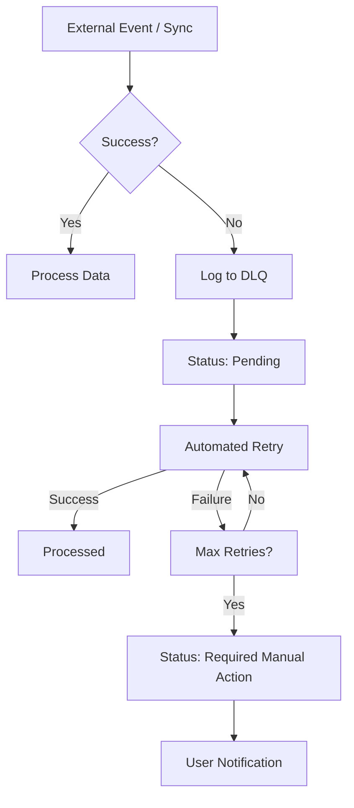

# Integration Hub - Module Documentation

The Integration Hub is the central engine for connecting LaunchSin to external data sources (Hotmart, Ads, etc.). It is designed with a "Fail-Safe" architecture to ensure data integrity even during external API outages.

## Architecture Overview

1. **Source Connections**: Stores credentials and configuration. Secrets are never stored in plain text here; they are referenced via `secret_refs`.
2. **Sync Runs**: Every data synchronization is tracked. This provides observability into data freshness.
3. **Dead Letter Queue (DLQ)**: When a sync fails or a webhook payload is malformed, the event is moved to the DLQ instead of being silently dropped.
4. **Alerting**: Critical integration failures trigger `integration_alerts` which are surfaced in the Status Center.

## Fail-Safe DLQ Lifecycle

## Security & Isolation

- **Tenant Scoping**: All integration data is scoped by `org_id` and `project_id`.
- **Secret Masking**: Secret values are handled by the server-side vault. The database only stores `secret_id_ref`.
- **RBAC**: Only users with `admin` or `owner` roles can modify connections.
